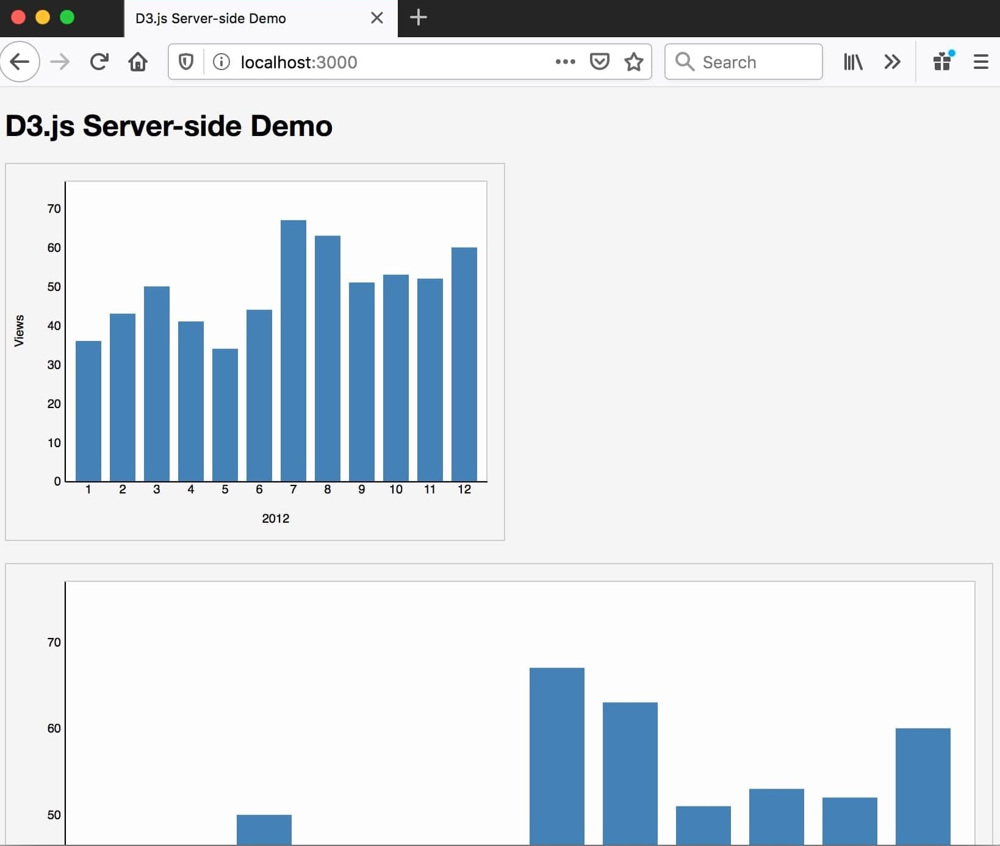

# d3-server-side-demo

This project uses [D3.js](https://github.com/d3/d3) to render visualizations on the server-side with Node.js.

## Getting Started

1. Use Node.js version 12 or greater.
1. Install dependencies with `npm install`
1. Run development server with `npm start` and go to
[http://localhost:3000/](http://localhost:3000/)

